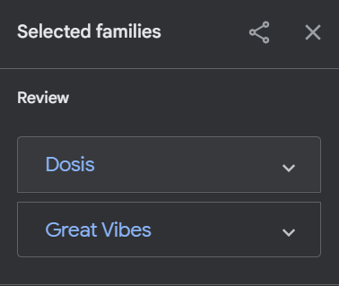
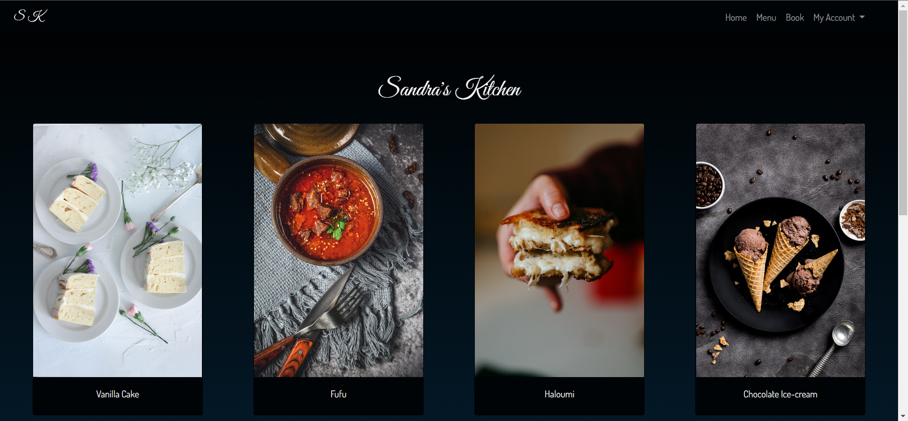
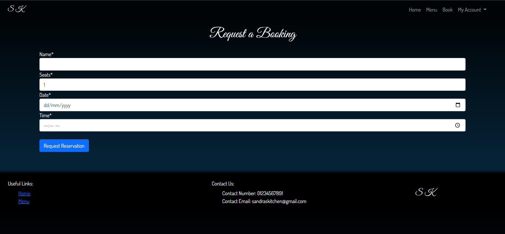
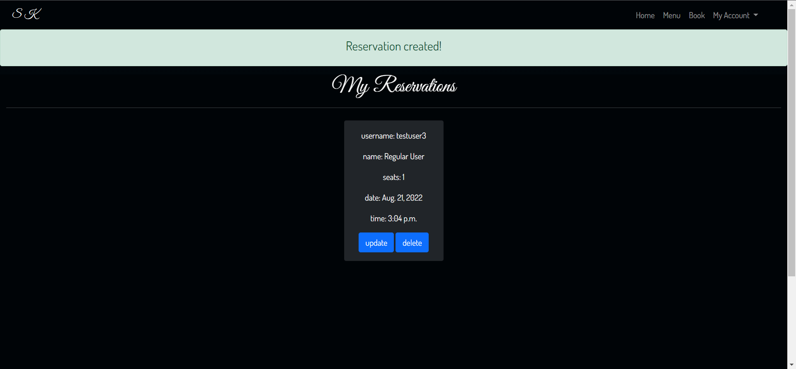

# Sandra's Kitchen

## Introduction

Sandra's Kitchen is a restaurant booking website aimed at providing a secure place for customers to make and manage bookings.

# UX

## Strategy 

I used an agile methodology when planning the project via the use of projects and issues. The latter used to create user stories which formed the main guide when building the project.

CRUD functionality is everything when it comes to this webapp as user interaction is paramount. The user creates a booking then the webapp provides feedback and allows the user to read all the bookings they have made. The user has the option to update the booking details and if they do so choose, delete any bookings.

The webapp tries its best to eliminate user error with the implementation of validation. The user is unable to make two reservations for the same day which in turn eliminates the ability to duplicate bookings. The user is also forced to stick to constraints when selecting a time and date. 

## External User Goal

The customer wants to book a table at a restaurant.

## User Stories

- As a user I want to book multiple seats.
- As a user I want to book a specific date.
- As a user I want to book a specific time.
- As a user I want to see the restaurant menu.
- As a user I want to see the restaurant opening times.
- As a user I want to edit my booking.
- As a user I want to delete my booking.
- As a user I want to register an account.
- As a user I want to log into my an account.
- As an admin I want to delete accounts.
- As an admin I want to edit a booking.
- As an admin I want to delete a booking.

## Site Owner Goal

- Provide attractive site for customer booking.

# Structure 

## Database 

## Wireframes 

#### Menu

#### Registration

#### Login

#### Booking

# Design

## Color Scheme

As I am supplying a webapp for a food company I decided to use dark colours to makeup the background. I decided upon a gradient as I found it gave the background subtle character and allowed the images and forms to pop. The dark gradient brings the content to life and makes it the main attraction.

## Font Choice

I went on [google fonts](https://fonts.google.com/) and browsed through a selection of fonts. I used a variety of sample text to have visual comparison and settled on what I found to be a sleek font for the headings of my webpages and a tidy font for the data.

## Features

### Login Page

### Registration Page

### Gallery of Menu

### Menu Page with title and details

### Make Reservation page

### Manage Reservation page

### Delete Reservation page

### Update Reservation page

### Future Features

- Price displayed under each menu item
- A opening and closing time as well as form validation to meet these limitations.

## Technologies Used

- Git used for version control.
- [GitHub](https://github.com/) was used for securely storing code.
- [Gitpod](https://gitpod.io/) is the cloud based IDE.
- Python3 is used for the main code logic.
- [Django](https://www.djangoproject.com/) was used as the framework.
- PostgreSQL was used for storing data.
- [Cloudinary](https://cloudinary.com/) was used for storing static files.
- [Heroku](https://heroku.com/) was used for live deployment.
- [ShareX](https://getsharex.com/) for capturing screenshots.
- [Bootstrap](https://getbootstrap.com/) for  website design and responsiveness.
- [Font Awesome](https://fontawesome.com/) for the icons.

## Testing

To view all testing documentation please refer to [TESTING.md](TESTING.md)

## Deployment

### Heroku

The site was deployed using [Heroku](https://heroku.com/). The application can be found using this link - [Mama's Kitchen](https://sandras-kitchen.herokuapp.com/).

The steps are as follows:

- Log-in or Sign-up to Heroku.
- From the Dashboard click "New" then "Create New application".
- Enter a project name (unique), select a region then press "Create application".
- This will create an application and open the deploy tab. From here select the "Settings" tab.
- Set your Environment Variables by navigating to Reveal Config Vars.
Scroll up and head to the "Deploy" section to choose deployment method. Select "GitHub" and in the "connect to GitHub" section link your GitHub account.
- Scroll down to the manual deploy option and select "Deploy Branch".
- The application will now be built. Once completed a 'Your application Was Successfully Deployed' message and a link will appear.

### Local Deployment

To make a local copy of this project, you can clone it by typing the following in your IDE terminal:

- `git clone https://github.com/devisis/sandras-kitchen.git`

Alternatively, if using Gitpod, you can click below to create your own workspace using this repository.

Once your project is ready for coding, you must download the required dependencies from the requirements.txt file. You can type:

- `pip3 install -r requirements.txt`

Please note, for this particular project, there aren't any required dependencies, however, the file is still necessary in order to get the application running on Heroku.
Additionally, Heroku will require a `Procfile`, so you can type:

- `echo web: node index.js > Procfile`

## Credits

When stuck on code I spent a lot of time browsing online forums and documentations for the sites listed below.

- Bootstrap docs were referred to when creating cards and the navbar.
    - https://getbootstrap.com/docs/5.2/components/navbar/#how-it-works
    - https://getbootstrap.com/docs/5.2/components/card/#about
- Stackoverflow was used when it came to validating model forms. 
    - https://stackoverflow.com/questions/849142/how-to-limit-the-maximum-value-of-a-numeric-field-in-a-django-model
    - https://stackoverflow.com/questions/60871630/login-required-decorator-on-a-class-based-view-in-django
    - https://stackoverflow.com/questions/61076688/django-form-dateinput-with-widget-in-update-loosing-the-initial-value
- Django docs were used for pretty much every last piece of code as it was vital that I followed the specification.
    - https://docs.djangoproject.com/en/4.1/
- Youtube was used for help with the creation of class based views.
    - https://www.youtube.com/playlist?list=PLOLrQ9Pn6caxNb9eFZJ6LfY29nZkKmmXT
- Unsplashed was used for selecting unlicensed images.
    - https://unsplash.com/photos/ZgfMmFGGf-E

## Acknowledgements

- Thank you to my mentor for help and support.
