# Testing

To return to readme documentation please click here [README.md](README.md)

## User Story Testing

### As a user I want to book multiple seats.

- A user has the option of entering a number themselves, or pressing the arrows situated to the right until they reach a number that suits them. As there are a limited amount of seats available, if a user selects a number greater than this limit then an error is displayed.

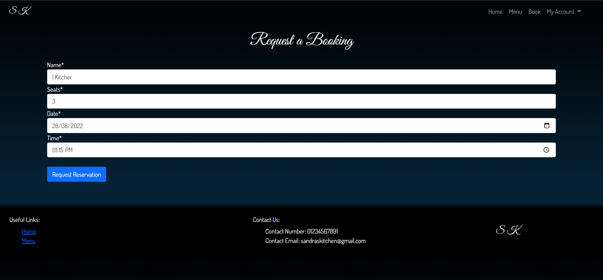

### As a user I want to book a specific date.

- A user has the option of entering a date themselves, or selecting from the calender. As there are a limited amount of bookings available, users are limited to one booking per day.
- Users are not allowed to book on the same day or a date that's in the past.

### As a user I want to book a specific time.

- Users can enter a time themselves or select from the time input function.

### As a user I want to see the restaurant menu.

- When a user clicks on the menu navigation option they are taken to the menu page.

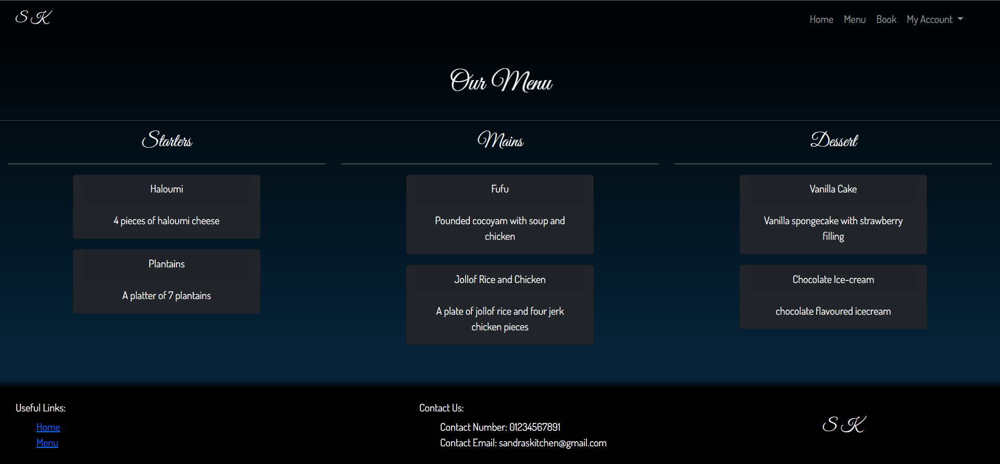

### As a user I want to edit my booking.

- A user has the option to edit their booking when they press the update button. Once they press submit if the form validates then it will update their initial booking.

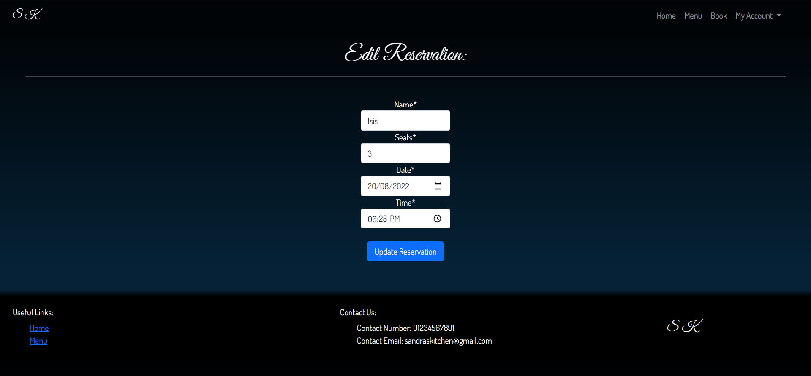

### As a user I want to delete my booking.

- When the user chooses to delete their booking they are sent to a delete confirmation page where it asks if they are sure they want to make this decision. If yes the reservation will be deleted.

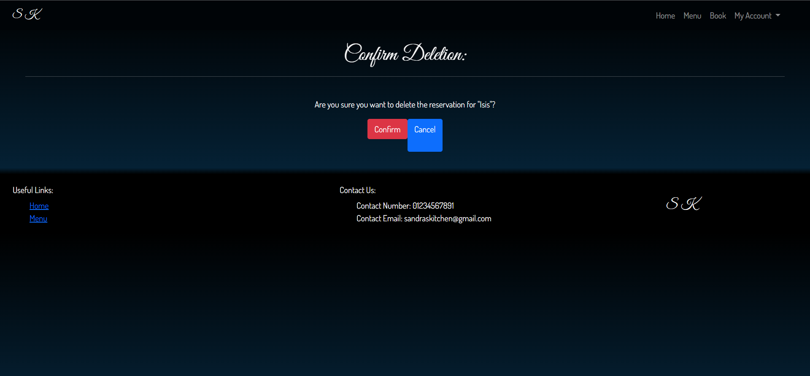

### As a user I want to register an account.

- After navigation to the registration page a user is able to enter their details and register for the site.

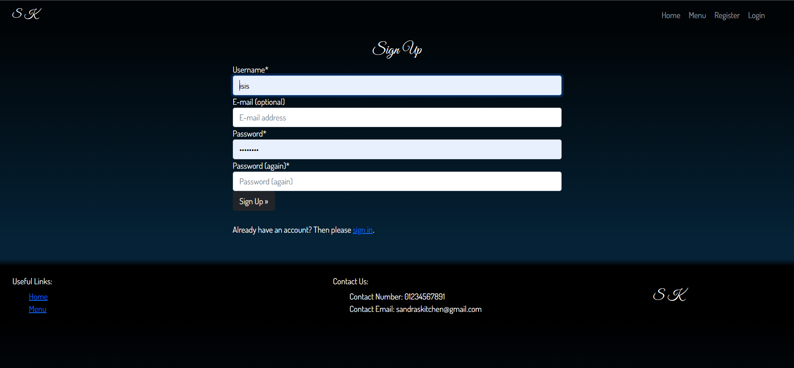

### As a user I want to log into my an account.

- If the user enters the correct login details they will be granted access to the website

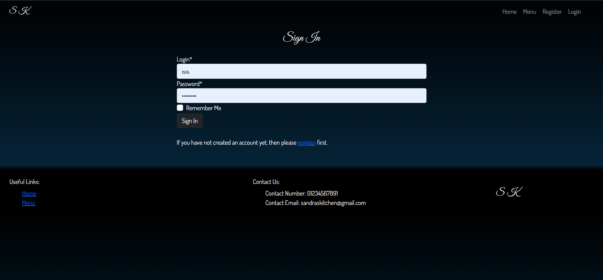

### As an admin I want to delete accounts.

- As an admin I can select which accounts I would like to delete through the admin panel.

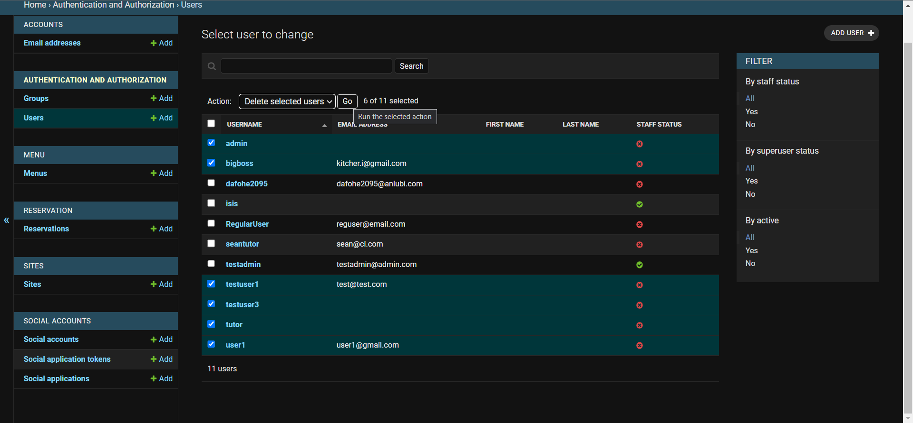

### As an admin I want to edit a booking.

- As an admin I have access to all user bookings and have the option to update them.

### As an admin I want to delete a booking.

- As an admin I have access to all user bookings and have the option to delete them.

## Code Validation

### HTML

[Nu Html Checker](https://validator.w3.org/)
[rocketvalidator](https://rocketvalidator.com/)

Upon initial testing of my html I had a few issues with nesting and my head element being in the wrong place. I have fixed these issues to the best of my knowledge. 

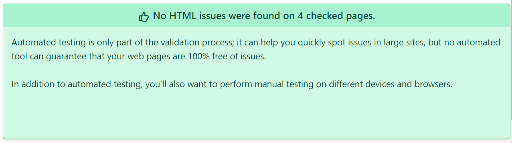
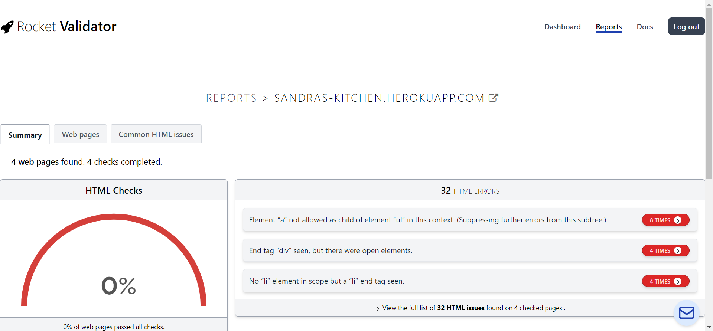

### CSS 

[Jigsaw](https://jigsaw.w3.org/)

I copied and pasted my css into the input section and checked my css. Everything seems to be in order with nothing wrong.

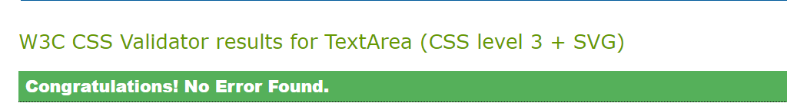

### Python

[PEP8](http://pep8online.com/)

My code was copied and pasted into the pep8 checker to see if all of my code was pep8 complient. I had a few files which exceeded the length required but it was a quick fix.

## Browser Compatibility

I have navigated through the site using three main internet browsers, chrome, firefox and edge. I am yes to come across any compatibility issues.

### Chrome

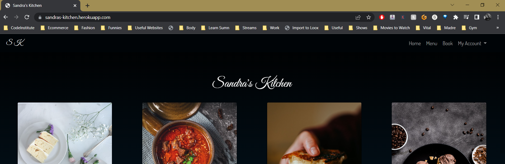

### Firefox 

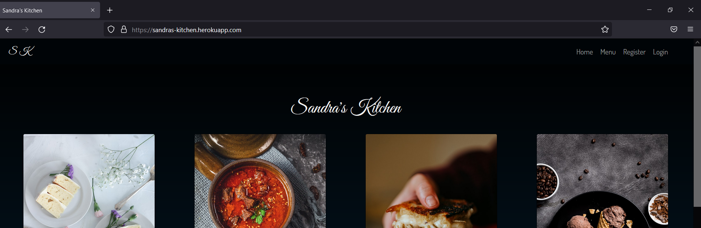

### Edge

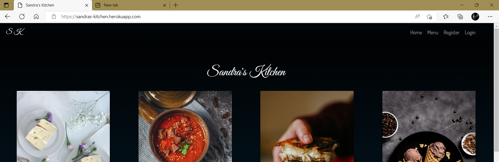

## Browser Responsiveness

I used chrome developer settings to test the responsiveness of the site on 3 devices with varying sizes. Iphone 5, the Iphone12 and the Ipad Air.

### Iphone 5SE

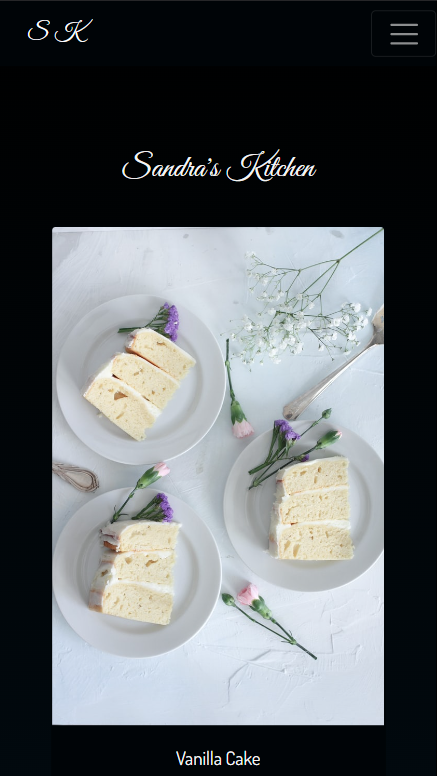

### Iphone 12

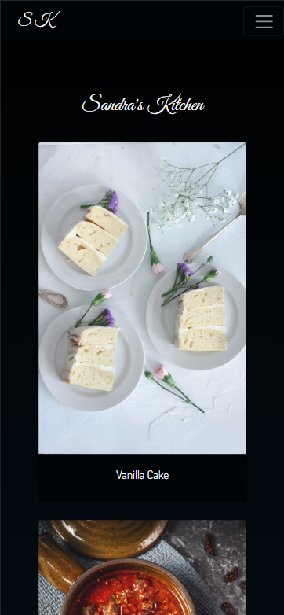

### Ipad Air

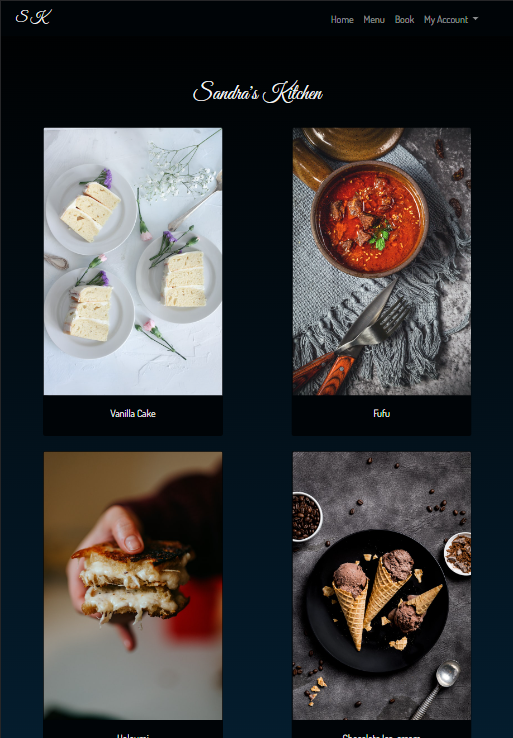

## Bugs

### Fixed Bug

- Users were able to access parts of the site by using the url or back button when logged out.
- Users were able to make a reservation for a past date.
- Users were able to make a reservation for 0 seats.
- Users were able to view, update and delete reservations made by all users.

### Unfixed Bug

- Users are able to book for any time they want.
- According to a test user the date-time function was buggy, as it was fine on my iOS it seems to be an Android issue.
    - 